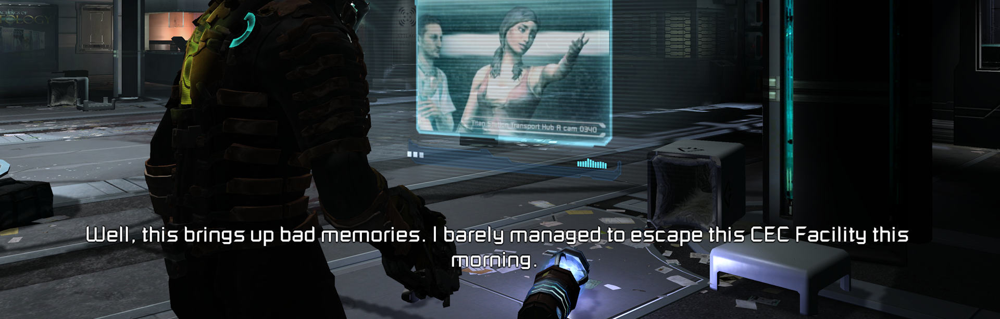

  

A patch that fixes various issues and limitations in the PC port of Dead Space 2.

## How to Install

> [!NOTE]  
> Compatible with all versions of Dead Space 2 (Steam, EA App).
>
> **Download**: [MarkerPatch.zip](https://github.com/Wemino/MarkerPatch/releases/latest/download/MarkerPatch.zip)  
> Extract the contents of the zip file into the game's folder, in the same directory as the `deadspace2.exe` file.

### Steam Deck/Linux Specific Instructions (Windows users can skip this)

> [!WARNING]
> To launch the game on Steam Deck or Linux, open the game's properties in Steam and include `WINEDLLOVERRIDES="dinput8=n,b" %command%` in the launch options.
>
> **Note**: DXVK limits the framerate to 60 FPS by default. To increase this limit, add the following to your launch options (example for 120 FPS):  
> `DXVK_FRAME_RATE=120 WINEDLLOVERRIDES="dinput8=n,b" %command%`

# Features

## Havok Physics Fix

Stabilizes physics behavior at high framerates to eliminate the annoying flying corpses and limbs. While physics issues begin above 30 FPS, they become noticeably problematic after 100 FPS, causing dead bodies and severed limbs to launch erratically across rooms.

## High-Core CPU Fix

Prevents the game from crashing on systems with more than 10 CPU cores. The game's CPU detection code collects information about each core into fixed-size arrays, but these arrays weren't sized to handle more than 10 cores. When more cores are detected, the code overflows these arrays, corrupting memory and causing crashes later during execution. The patch stops the CPU detection loop early to prevent this overflow.

## VSync Refresh Rate Fix

Corrects the VSync implementation to use the refresh rate selected in the game's settings instead of locking to 30 FPS. The original implementation ignores your chosen refresh rate and forces 30 FPS when VSync is enabled.

  <table>
    <tr>
      <td width="50%"></td>
      <td width="50%"></td>
    </tr>
    <tr>
      <td align="center">Vanilla (Locked to 30 FPS)</td>
      <td align="center">MarkerPatch (Uses Selected Rate)</td>
    </tr>
  </table>

## Automatic Weapon Fire Rate Fix

Stabilizes the fire rate of automatic weapons across all framerates. The game's weapon cooldown system checks more frequently at higher framerates, causing automatic weapons like the Pulse Rifle and Flamethrower to fire progressively faster as FPS increases.

## Save System Fixes

### Difficulty Reward Tracking
Fixes the tracking of Zealot and Hardcore difficulty completions to properly unlock rewards. 

> **Important**: This fix requires starting a new save with the patch installed. You must keep the patch installed for the entire playthrough for the fix to remain effective.

### Suit ID Conflicts
Resolves item database conflicts where certain DLC suits incorrectly share IDs with other suits:
- **Zealot Suit** was conflicting with the Security Suit.
- **Hacker Suit** was conflicting with the Elite Advanced Suit.

These conflicts would cause one suit to overwrite the other in your inventory, making purchased items disappear.

### String Buffer Overflow Prevention
Prevents crashes that can rarely occur when the game enumerates save files. This happens in two scenarios: when checking for Dead Space 1 saves to grant the DLC bonus for owning the first game, and when listing your Dead Space 2 save files in the load menu. Though these crashes are uncommon, they can be frustrating when they do occur.

## Subtitle Font Scaling

Scales subtitle text appropriately for high resolutions. The game was designed with console limitations in mind and intentionally prevents subtitles from scaling beyond 720p resolution, making them tinier at 1080p and above. This fix removes that limitation and allows proper scaling.

For those who prefer different subtitle sizes, `FontScalingFactor` in `MarkerPatch.ini` allows fine-tuning the subtitle text size to personal preference.

  <table>
    <tr>
      <td width="50%"></td>
      <td width="50%"></td>
    </tr>
    <tr>
      <td align="center">4K Vanilla</td>
      <td align="center">4K MarkerPatch</td>
    </tr>
  </table>

## Raw Mouse Input

Implements proper raw mouse input to fix sensitivity issues. This works similarly to the existing "Dead Space 2 Mouse Fix" mod with several improvements:
- Added support for zero-gravity areas. (the original mouse fix didn't work properly in zero-G)
- Sensitivity scaling now matches the in-game sensitivity settings more accurately.
- Does not interfere with controller inputs when switching between mouse and gamepad.

The fix decouples mouse sensitivity from the game's framerate, providing consistent aiming regardless of FPS.

## Input Device Filtering

Blocks all DirectInput devices except mouse and keyboard to prevent unwanted camera spinning from devices like racing wheels, flight sticks, and other peripherals. This also removes a slow XInput compatibility check that runs on every connected device during enumeration, significantly improving startup time.

> **Note**: XInput controllers are unaffected and will continue to work normally.

The game initializes various controller and input devices on startup, which can cause the camera to spin uncontrollably when these devices send unintended signals. Additionally, the original code performed an unoptimized XInput compatibility check on every enumerated device, causing noticeable delays during game startup.

## Anisotropic & Trilinear Filtering

### Anisotropic Filtering
Forces anisotropic texture filtering on all textures to improve clarity at oblique viewing angles. The original game already uses anisotropic filtering selectively on specific surfaces where developers determined it had the most visual impact (primarily floors and other large flat surfaces). 

In a [Beyond3D interview](https://beyond3d.com/content/interviews/45/3), a developer explained the approach they took: "I once found an entire room in the game tagged as aniso. Our artists had secretly started using that flag because it looked better. Unfortunately doing an entire room was way too much and we removed it... I've never measured the cost but it doesn't take much to feel its impact on the scene so we only use it on big win items."

This patch overrides the selective approach and applies anisotropic filtering universally to all textures. With modern PC hardware, the performance concerns that led to the original selective implementation are no longer relevant.

Set `MaxAnisotropy` from 2 to 16 (16 recommended) for best results.

  <table>
    <tr>
      <td width="50%"></td>
      <td width="50%"></td>
    </tr>
    <tr>
      <td align="center">Vanilla (Selective Anisotropic)</td>
      <td align="center">Forced 16x on All Textures</td>
    </tr>
  </table>

### Trilinear Filtering
Forces proper trilinear filtering for smoother texture transitions between mipmap levels.

## Disable Online Features

Prevents connection attempts to EA servers at startup and prevents error messages from appearing. Also removes the shop warning that some features might be unavailable due to being disconnected from servers. Since the servers are permanently offline, these messages serve no purpose and only clutter the interface.

  <table>
    <tr>
      <td width="50%"></td>
      <td width="50%"></td>
    </tr>
    <tr>
      <td align="center">Boot Error Message (Removed)</td>
      <td align="center">Shop Warning (Removed)</td>
    </tr>
  </table>

## Entity Persistence

Increases the maximum number of bodies, limbs, and decals that can remain in the environment. The game normally keeps only a limited number of corpses and removes the oldest ones as new enemies are killed, likely a limitation designed for consoles. This patch raises that limit, preventing the immersion-breaking effect of bodies disappearing during combat and giving you adequate time to loot corpses before they're removed.

  <table>
    <tr>
      <td width="50%"></td>
      <td width="50%"></td>
    </tr>
    <tr>
      <td align="center">Vanilla (Battle aftermath with few bodies)</td>
      <td align="center">MarkerPatch (All bodies still present)</td>
    </tr>
  </table>

## Auto Resolution

Automatically sets the game to your screen resolution on first launch instead of defaulting to 1024×768.

## Skip Intro

Bypasses the EA/Visceral Games intro video on launch when `SkipIntro = 1`.

## DLC Management

Control which DLC items appear in the store. Normally, when you reach the first shop, the game automatically floods it with all available DLC items as free purchases, which can be overwhelming and break the intended progression. This patch allows you to selectively enable only the DLC items you want.

Available DLC options (configurable in the `[DLC]` section of `MarkerPatch.ini`):

**Hazard Pack:**
- Hazard Engineering Suit & matching Line Gun.
- Shockpoint Advanced Suit & matching Ripper.
- Triage Security Suit & matching Javelin Gun.

**Martial Law Pack:**
- Bloody Vintage Suit & matching Flamethrower, Force Gun and Javelin Gun.
- EarthGov Security Suit & matching Detonator, Pulse Rifle and Seeker Rifle.

**Supernova Pack:**
- Agility Advanced Suit & matching Plasma Cutter, Rivet Gun and Pulse Rifle.
- Forged Engineering Suit & matching Plasma Cutter, Line Gun and Ripper.
- Heavy-Duty Vintage Suit & matching Contact Beam, Detonator and Line Gun.

**Severed DLC:**
- Patrol Suit (Isaac) & Patrol Seeker Rifle.

**Bonus Content:**
- Rivet Gun DLC (Pre-Order Content).
- Zealot DLC: Zealot Suit & matching Force Gun (Collector's Edition Content).
- Hacker DLC: Hacker Suit & matching Contact Beam (Ignition Rewards).

> **Note**: All DLC options are disabled by default because automatically granting all DLC items at the first shop of your first playthrough would be poor game design. You can selectively enable the DLC items you want through the configuration file to maintain better pacing. Since the EA servers are offline, ownership verification can no longer be performed for certain DLC items that previously required it.

> **Important**: This only works if the DLC items haven't already been added to the shop, as shop inventory is tied to save data. Items already in your save cannot be removed, so configuring DLC requires starting a new save file if you want different items available.

## dinput8 Chaining Support

Chains another `dinput8.dll` by loading `dinput8_hook.dll` for mod compatibility.

## Configuration

All features can be customized via the `MarkerPatch.ini` file. Each setting includes detailed comments explaining its function and acceptable values. The patch uses sensible defaults that work for most users, but allows fine-tuning of every aspect.

# Credits

- [safetyhook](https://github.com/cursey/safetyhook) for hooking.  
- [mINI](https://github.com/metayeti/mINI) for INI file handling.  
- [CRASHARKI](https://github.com/CRASHARKI) for the logo.
